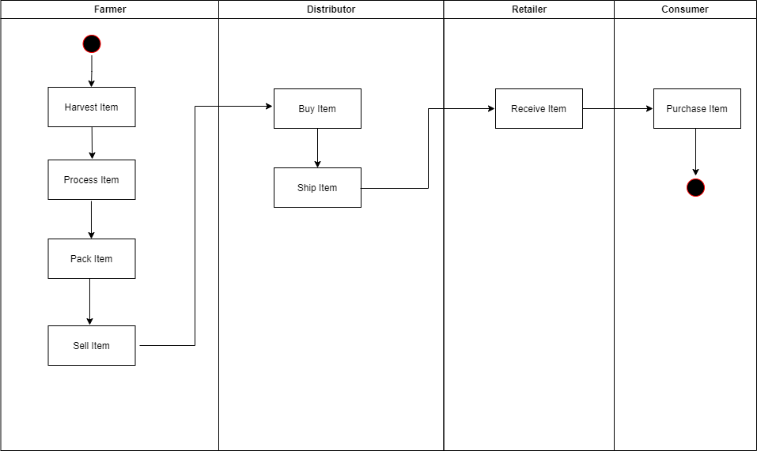

# Decentralized Supply chain application

This repo contains code related to supply chain DApp to show different actions taken in a typical supply chain application. There are four main roles in the workflow of the porject 1. Farmer, 2. Distributor 3. Retailer and 4. Consumer. Below are the actions for each role:
1. Farmer:
Harvest --> Process --> Pack --> ForSale
2. Distributor:
Buy --> Ship
3. Retailer:
Receive
5. Consumer
Purchase

### High level design representation of the workflow:

#### Activity Diagram:


#### State Diagram:


#### Sequence Diagram:


#### Class Diagram:


### Supply Chain Contract
https://rinkeby.etherscan.io/address/0x4561576e82e54c47e0768407aa528a2f95dd3dba

### Libraries used the project:
1. Node.js
2. NPM: Node Package Manager
3. Truffle: Development framework for Ethereum
4. Ganache: For test accounts to be used on ethereum
5. webpack-dev-server: For running node website on localhost
6. IPFS - For hosting website on blockchain
7. MetaMask extension in your browser

### Running the application

Change directory to ```supplychain-dapp``` folder and install all requisite npm packages (as listed in ```package.json```):
```
cd supplychain-dapp
npm install
```
Compile smart contract:

```
truffle compile
```
Migrate smart contracts to the locally running blockchain, ganache-cli:

```
truffle migrate
```
If deploying on rinkeby - use truffle migrate --reset --network rinkeby

```
truffle test
```

All 10 tests should pass.


Launch the front-end for the DApp from a separate terminal window:

```
npm run dev
```
Push front-end site on to IPFS either using IPFS Desktop or IPFS cli
```
npm install --save ipfs-api
npm install --save-dev brfs
ipfs.exe add -r supplychain-dapp
//To publish pin
ipfs.exe name publish <<hashid of supplychain-dapp folder>>
```

IPFS Site: https://ipfs.io/ipfs/Qmbx7Ymn63PPHE5MggGwowy3Q61s1HDwhZWpAJym3PDRab/
If you get gateway timeout accessing the IPFS site, make sure atleast one node is serving your content by executing: 
```
ipfs.exe dht findprovs Qmbx7Ymn63PPHE5MggGwowy3Q61s1HDwhZWpAJym3PDRab
```
